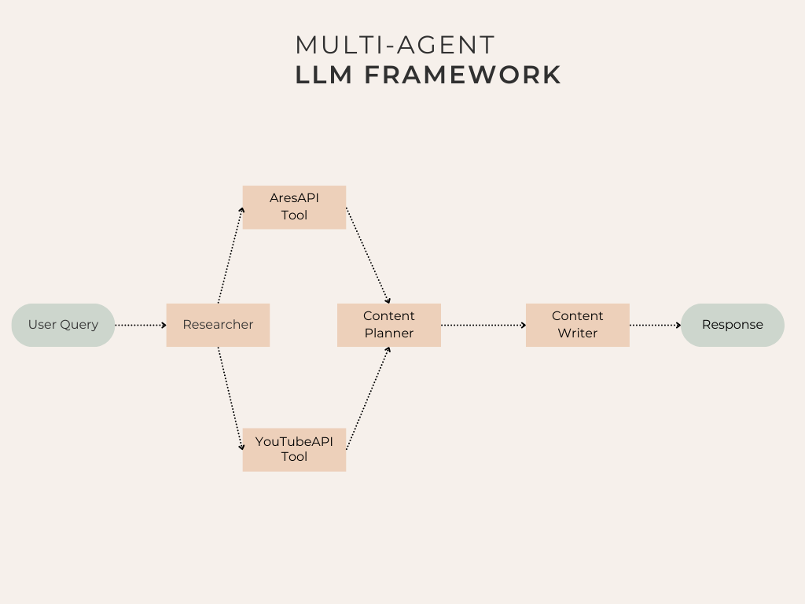

# Multi-Agent LLM with Real-Time Search Capabilities

_Author: Muhammad Arham_

<p>This repository uses CrewAI multi-agentic capabilites and combines them with real-time internet and youtube search to provide a general-purpose LLM. It fetches up-to-date information using YouTubeDataAPI and Traversaal's ARES API to answer user's query in the best possible manner.
</p>

## Setup

1. Install Ollama if you want to use a locally-served LLM. Download and install from the official package available on their <a href="https://ollama.com/">website.</a>
2. Create a .env file and add the required API Keys and URLs following the provided .env.example file. The package requires API Keys for YouTubeDataAPIv3 and Traversaal's Ares API.
3. A simple bash file is provided that creates a Python environment and sets up the FastAPI backend and the streamlit-based frontend.

```
bash runfile.sh
```

## Implementation Details

We use <a href="https://docs.crewai.com/">CrewAI</a> as our agentic-framework that comprises of three simple parts. The framework is summarized in the image below:<br>
</img>
<br>

### Choice of LLM

The implementation currently supports Ollama and Cohere as LLM providers.
The primary choice is Llama3.1-8B served locally using Ollama due to its state-of-the-art performance on multi-purpose tasks, and multi-modal capabilties.
<br>Nonetheless, given memory constraints and RAM issues, hosting a LLM locally can be a challenge. Cohere API can be used as an external source for LLM responses that aleviates the constraints.
